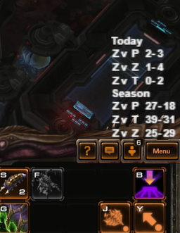

# SC2 AI coach and streaming tools 

## AI Coach

[aicoach.py](aicoach.py) is a GPT powered coach that can answer questions on past Starcraft games and the strategies employed by the opponent player. 

Examples: 

> When did I last play againt this player? 
> What was the opening build order of this player, in summary? 
> What tech choice does this player go for usually? 
> How many workers does this player have by the 6 minute mark? 

The AI coach is embedded with a voice engine and can be interacted with live during gameplay via microphone. 

A new chat session with the AI coach is initiated whenever [obs_watcher.py](obs_watcher.py) detects a new match and find past games for the players in the match. 

## SC2 map stats

[parse_map_loading_screen.py](parse_map_loading_screen.py) can parse the currently played map from a screenshot and provide a stream overlay with this season's map win/loss statistics by matchup. The statistics are taken from https://sc2replaystats.com/ if a public account exists for the player. 

## SC2 replay stats

This is a quick hack to show the players 1v1 win/loss stats of the current season. The stats are serves as a simple HTML table via localhost:8080 and can be included in a stream overlay in OBS.

#### How to embed

Embed in OBS as a browser source with a local file for map stats, and on localhost:8080 for replay stats. Adapt template.html to change the styling of the result table. 

Note: scanning replays is slow (~0.2-0.5 seconds per replay). Per default this auto-refreshes every 30 seconds. This can be adjusted in template.html as well. 

