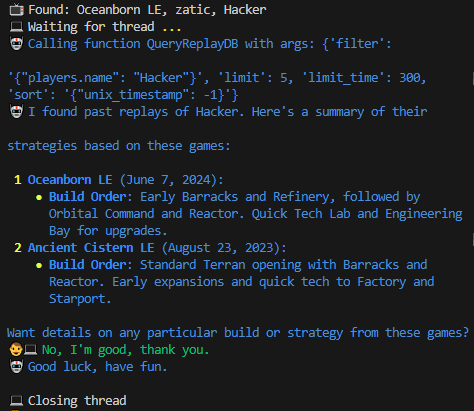
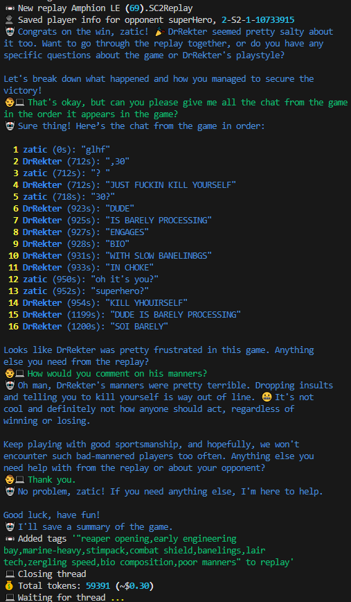
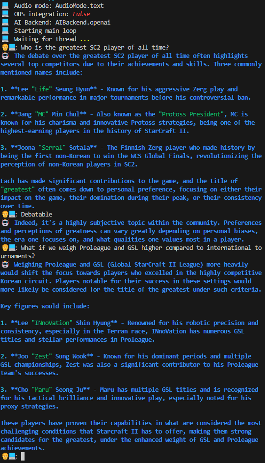

# SC2 AI coach

## AI Coach

[coach.py](coach.py) is a GPT4 powered coach that can help a StarCraft ladder player. It's set up to run with a voice interface during a gaming session and can answer questions from replay history and about opponents such as

- When did I last play againt this player?
- What was the opening build order of this player, in summary?
- Is this player a smurf?
- Translate the ingame conversion to English please.

The AI coach is embedded with a voice engine and can be interacted with live during gameplay via microphone.

New chat sessions with the AI coach are initiated when a new ladder game is starting, when a game just finished, or on voice command ("hey jarvis"). The GPT assistant behind AI coach can use mulitple high level capabilities like query a MongoDB replay database, lookup a player's battle net profile, or add data such as comments to a replay. The assistant decides autonomously without explicit programming when to employ a capability.

This is my personal research project to explore the latest in LLM based agents.

### Examples

Looking up past games when a new game is being played:



Analyzing a replay after a game just finished:



Answering arbitrary questions on SC2:



## Minimal Setup

Instructions for a minimal setup without voice integration. Text only, "chat with your replays". Some Python experience required.

### Python environment

Developed and tested with Python 3.12.

Install with uv: https://docs.astral.sh/uv/

```sh
> uv sync
```

### Configuration

All settings can be done in `config.yml`, or better in a `config.yourname.yml` file in the same directory. Any config.xx.yml file overwrites values from config.yml. So you can simply add a `config.yourname.yml` file and only overwrite your student settings.

Set `replay_folder` to point to where your SC2 ladder replays are being saved.

```yaml
# config.yourname.yml

replay_folder: "C:\\Users\\yourname\\Documents\\StarCraft II\\Accounts\\1234\\2-S2-1-1234\\Replays\\Multiplayer"
student:
  name: "yourname"
  race: "Terran"
```

The rest of the settings will be taken from `config.yml`.

Secrets are configured with environment variables. Either provide them at runtime or put them in a dotenv file, like [.env.example](.env.example). (But copy to `.env` since the example file is ignored).

### Database

Any MongoDB > 4.5 will do. Either setup one by yourself, or follow the instructions in [mongodb/](mongodb/README.md) on how to setup a local database for dev/testing.

If you setup your own MongoDB, create a database and add the DB name to settings:

```yaml
# config.yourname.yml

replay_folder: "C:\\Users\\yourname\\MyReplays"
student:
  name: "yourname"
  race: "Terran"
db_name: "YOURDB"
```

and add the MongoDB connection string to the env variable `AICOACH_MONGO_DSN`.

### Populate DB

Use the tool [repcli.py](repcli.py) to populate your DB with replays. The tools offers a few options:

```sh
> python repcli.py --help
```

```text
Usage: repcli.py [OPTIONS] COMMAND [ARGS]...

Options:
  --clean        Delete replays from instant-leave games
  --debug        Print debug messages, including replay parser
  --simulation   Run in simulation mode, don't actually insert to DB
  -v, --verbose  Print verbose output
  --help         Show this message and exit.

Commands:
  add       Add one or more replays to the DB
  echo      Echo pretty-printed parsed replay data from a .SC2Replay file
  query     Query the DB for replays and players
  sync      Sync replays and players from replay folder to MongoDB
  validate  Validate all replays in the DB.
```

Run

```sh
> python repcli.py sync --from=2024-01-01 
```
to read all 1v1 ladder replays from beginning of 2024, and add the replays and the players from the replays to the DB. 

Use the `--simulation` flag to just read replays but not commit to DB. 

The `replays` collection of the DB should now be populated with replay documents.

See `python repcli.py sync --help` for more options. You can always repopulate the DB from replay files without destroying anything. AICoach does not change anything on the replay data in the DB.

### OpenAI

Prerequisites:

- Setup an OpenAI account and fund with credits
- Create an OpenAI Assistant
- Create an API key.

Add your OpenAI organization, Assistant ID, and API key to the env variables, `AICOACH_ASSISTANT_ID`, `AICOACH_OPENAI_API_KEY`, `AICOACH_OPENAI_ORG_ID`.

Note on cost: Long conversations can cost up to one dollar ($1.00) in OpenAI API usage. Typically interactions stay below $0.10 however. AICoach will not incur API costs until one of the wake events is triggered - see below.

If you just want a database with your replays you can skip this step and the next or do it later.

### Build and deploy assistant

```sh
> python build.py
```

to build the assistant. You should have a new file [assistant.json](assistant.json).

```sh
> python build.py --deploy
```

to deploy the assistant to OpenAI. Check on https://platform.openai.com/playground if the assistant is initialized with tools and instructions.


### (Optional) Additional settings

Configure a wake hotkey. On pressing this key (combination) AICoach will wake up and ask for input. Default: `ctrl+alt+w`.

Configure student.emoji if you want to show a [different icon](./playground/emojis.txt) in the terminal output.

You can disable interactions with the `interactive` flag. If off, AI coach will speak, but won't listen for input.

```yaml
# config.yourname.yml

replay_folder: "C:\\Users\\yourname\\MyReplays"
student:
  name: "yourname"
  race: "Terran"
  emoji: ":woman_student:"
db_name: "YOURDB"
wake_key: "ctrl+alt+w"
interactive: False
```

## Run AICoach

```sh
> python coach.py
```

This will start a listener which reacts on different events. For each event, AICoach will perform an action and ask the student for input. Input can be typed into the terminal prompt.

Student can now chat with AICoach. As long as the conversation is kept going, AICoach will ask for input after it gave an answer.

AICoach determines by itself when the conversation is over. To end a conversation, simply thank AICoach.

### Wake event

Invoked when the wake key is pressed. AICoach does nothing initially and simply asks for a question.

### New replay event

When a new replay is added to the replay folder while AICoach is running, AICoach will:

- Add the replay to replay DB
- Offer to discuss the replay

On closing of the conversation, AICoach will save the conversation in `meta` along with a summary and some keywords which characterize the game.

### New game event

This is invoked at the very start of an SC2 game (when the in-game clock hits 1 second). AICoach will:

- Look in the DB for existing replays of the opponent
- Summarize past strategies of the opponent
- Ask for follow up questions

### Configure coach events

You can configure which events AICoach should react to with the `coach_events` option.

```yaml
# config.yourname.yml

replay_folder: "C:\\Users\\yourname\\MyReplays"
student:
  name: "yourname"
  race: "Terran"
  emoji: ":woman_student:"
db_name: "YOURDB"
wake_key: "ctrl+alt+w"
coach_events:
  - game_start
  - wake
  - new_replay
```

## Advanced setup

Please understand that this is a hobby project and not ready to run without some technical setup. You will need Python experience to get this running. This code is presented as-is and I can't provide support for it.

Prerequisites:

- all from minimal setup
- NVidia GPU
- Microphone

Review [Installation.md](Installation.md) for manual steps required. This will need Python experience and ideally some experience with machine learning with Python.

The full version integrates with OBS for interaction between OBS scene and the running AICoach. The OBS setup is not documented here and you can skip this part by keeping `obs_integration=False`.

More features implemented but currently not documented: 
- Twitch integration, AI coach listens and responds to questions in twitch chat
- Battle.net integration, AI coach can request profile information including portrait for players from battle.net
- SC2 pulse integration, AI coach can try to unmask barcodes 
- AI coach can try to determine if we are facing a smurf

## Limitations

Probably a lot...

- This is meant for competitives 1v1 ladder. Team games, arcade, customs are not supported and either explicidely excluded from replay processing or may cause unexpected behavior.
- Most of the internal logic relies on the name of a player(s) and thus won't work properly for a student who changes their name from season to season.
- This has only been tested with EU Battle.net. Possibly some functionality will break on NA/KR, etc
- This has only been tested with LotV replays starting from early 2023. Much older replays will likely throw errors.
- Text mode wake event interferes with SC2 causing lag. Don't use during gaming sessions.
- The production version is meant to run on Windows. Everything covered in unit tests runs on Win32 and Linux. 
