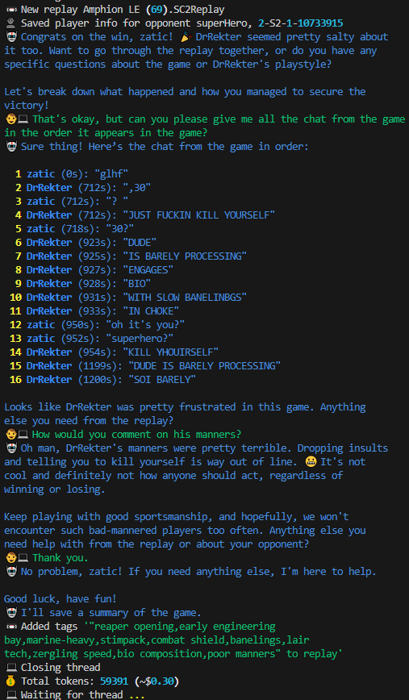
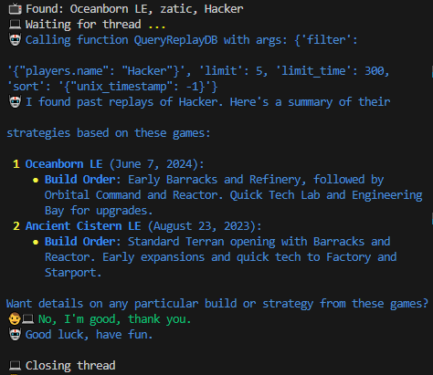
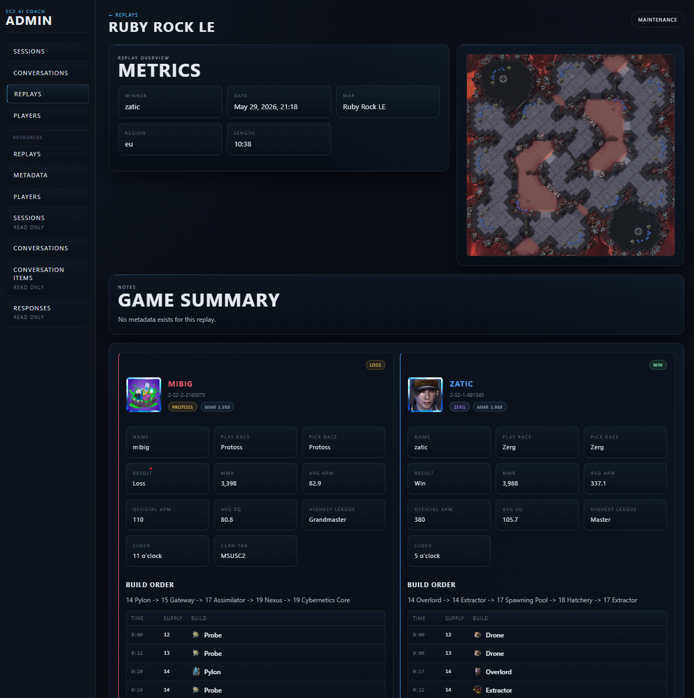
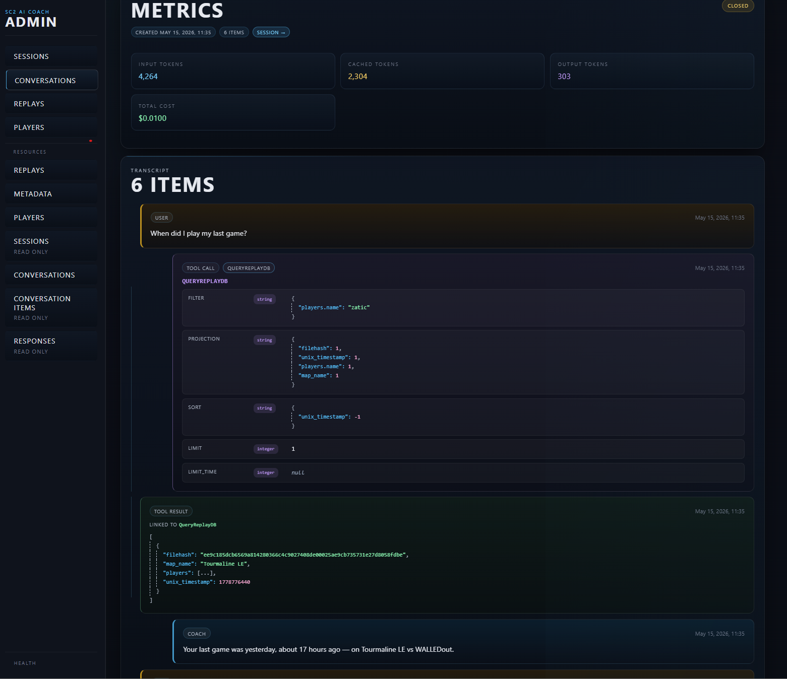

Kv# SC2 AI coach

## AI Coach

AICoach is an LLM-powered coach that can help a StarCraft ladder player. It's set up to run with a voice interface during a gaming session and can answer questions from replay history and about opponents such as:

- When did I last play against this player?
- What was the opening build order of this player, in summary?
- Is this player a smurf?
- Who is ahead in the current replay? 
- Cast the game from replay please

The AI coach is embedded with a voice engine and can be interacted with live during gameplay via microphone (optional, can run in text-only mode).

New chat sessions with the AI coach are initiated when a new ladder game is starting, when a game just finished, or on voice command. The LLM can use multiple high-level capabilities such as querying a replay database, looking up a player's Battle.net profile, or adding comments to a replay. 

This is a personal research project to explore LLM-based agents applied to competitive gaming.

### Examples

| Analyzing a replay after a game just finished | Looking up past games when a new game is being played |
|--|--|
|  |  |

### Replay DB

The app comes with a replay DB and a simple UI to review replay, players, conversations, and replay metadata. The UI is meant for keeping track of AI coach conversations and generated metadata. The replay data stored with AICoach is intentionally filtered to the basics, and the UI does not fully replace a replay DB like SCElight. 

| Replay DB UI | Analyzing an AICoach conversation |
|--|--|
|  |  |

## Minimal Setup

Instructions for a minimal setup without voice integration. Text only, "chat with your replays". Some Python experience required.

### Python environment

Developed and tested with Python 3.12.

Install with uv: https://docs.astral.sh/uv/

```sh
> uv sync
```

### Configuration

All settings can be done in `config.yml`, or better yet in a `config.yourname.yml` file in the same directory. Any `config.*.yml` file overwrites values from `config.yml`. This allows you to keep your personal settings separate.

At minimum, set `replay_folder` to point to where your SC2 ladder replays are saved:

```yaml
# config.yourname.yml

replay_folder: "C:\\Users\\yourname\\Documents\\StarCraft II\\Accounts\\1234\\2-S2-1-1234\\Replays\\Multiplayer"
student:
  name: "yourname"
  race: "Terran"
```

The rest of the settings will be taken from `config.yml`.

Secrets are configured with environment variables. Either provide them at runtime or put them in a local `.env` file. Note: `.env.example` is ignored by the application.

### Database and admin UI

Use [deploy/docker-compose.yml](deploy/docker-compose.yml) to start up a database and a DB admin UI. 

If you setup your own MongoDB, create a database and add the DB name to settings:

```yaml
# config.yourname.yml

replay_folder: "C:\\Users\\yourname\\MyReplays"
student:
  name: "yourname"
  race: "Terran"
db_name: "YOURDB"
```

and add the MongoDB connection string to the env variable `AICOACH_MONGO_DSN`.

### Populate DB

Use the tool [repcli.py](repcli.py) to populate your DB with replays. The tool offers a few options:

```sh
> uv run repcli.py --help
```

```text
Usage: repcli.py [OPTIONS] COMMAND [ARGS]...

Options:
  --clean        Delete replays from instant-leave games
  --debug        Print debug messages, including replay parser
  --simulation   Run in simulation mode, don't actually insert to DB
  -v, --verbose  Print verbose output
  --add-student  Create or update a player record for the configured student
                 during replay imports
  --help         Show this message and exit.

Commands:
  add       Add one or more replays to the DB
  echo      Echo pretty-printed parsed replay data from a .SC2Replay file
  query     Query the DB for replays and players
  sync      Sync replays and players from replay folder to MongoDB
  validate  Validate all replays in the DB.
```

Run

```sh
> uv run repcli.py sync --from=2024-01-01 
```
to read all 1v1 ladder replays from beginning of 2024, and add the replays and the players from the replays to the DB. 

Use the `--simulation` flag to just read replays but not commit to DB. 

The `replays` collection of the DB should now be populated with replay documents.

See `uv run repcli.py sync --help` for more options. You can always repopulate the DB from replay files without destroying anything. AICoach does not change anything on the replay data in the DB.

### AI Coach

Prerequisites:

- Set up an OpenAI account and fund it with credits
- Create an API key

Add your OpenAI organization and API key to the environment variables: `AICOACH_OPENAI_API_KEY` and `AICOACH_OPENAI_ORG_ID`. If you are using a custom OpenAI-compatible endpoint, also set `AICOACH_OPENAI_ENDPOINT`.

The default model is `gpt-5.4` (configurable via `gpt_model` in config). Model pricing, cached prompt pricing, reasoning effort, and reasoning continuity can be configured in `config.yml`; built-in pricing defaults are used when no override is provided.

**Note on cost:** Typically interactions stay below $0.10, but longer session can run up to and over $1.00 in API costs. AICoach will not incur API costs until one of the wake events is triggered.

If you just want a database with your replays you can skip this step and the next or do it later.

### (Optional) Additional settings

Configure a wake hotkey. When pressed, AICoach will wake up and ask for input (default: `ctrl+alt+w`).

Configure `student.emoji` if you want to show a [different icon](./playground/emojis.txt) in the terminal output.

Disable `interactive` if you want AICoach to speak but not listen for input:

```yaml
# config.yourname.yml

replay_folder: "C:\\Users\\yourname\\MyReplays"
audiomode: "text"
student:
  name: "yourname"
  race: "Terran"
  emoji: ":woman_student:"
db_name: "YOURDB"
wake_key: "ctrl+alt+w"
interactive: true
```

## Run AICoach

```sh
> python coach.py
```

This starts a listener that reacts to configured events. For each event, AICoach performs an action and asks the student for input.

For a direct text-only REPL that uses the same session and local conversation machinery without starting gameplay listeners, run:

```sh
> python coach.py --repl
```

Students can chat with AICoach. The conversation continues as long as both parties keep engaging. AICoach determines autonomously when a conversation is complete - typically when you thank it or say goodbye.

### Events

AICoach can be triggered by several events, configurable via `coach_events`:

#### Wake event

Invoked when the wake hotkey is pressed. AICoach asks for a question without additional context.

#### New replay event

When a new replay is added to the replay folder while AICoach is running:

- Adds the replay to the replay database
- Offers to discuss the replay with you

On conversation end, AICoach saves the conversation with a summary and keywords characterizing the game to replay metadata.

#### New game event

Triggered at the very start of an SC2 game (when the in-game clock hits 1 second):

- Looks in the database for existing replays of the opponent
- Summarizes the opponent's past strategies
- Asks for follow-up questions

### Configure coach events

Control which events AICoach responds to:

```yaml
# config.yourname.yml

coach_events:
  - game_start
  - wake
  - new_replay
```

## Advanced Setup (Voice + Full Integration)

Please note: This is a hobby project and advanced features are not ready to use without technical setup. Code is presented as-is without dedicated support.

**Prerequisites:**
- All requirements from minimal setup above
- torch, RealtimeTTS for voice synthesis
- xAI API key for transcription
- Livekit for wake word
- Microphone and speakers, ideally with NVidia Broadcast

For advanced setup with voice integration, see [Installation.md](Installation.md) for detailed steps. This requires Python experience and familiarity with machine learning tools.

### Optional Advanced Features

**OBS Integration** (keep `obs_integration=False` to skip):
- Integrates with OBS for scene control and display

**Additional implemented but undocumented features:**
- Twitch chat integration - AICoach listens and responds to Twitch chat
- Battle.net integration - retrieves player profile information and portraits
- SC2 Pulse integration - can unmask barcode players
- Smurf detection - analyzes whether opponents are smurfs
- Replay commentary - AICoach can commentate games from replays

## Limitations

- **Game type**: Designed for competitive 1v1 ladder only. Team games, arcade, and custom games are not supported and may cause unexpected behavior.
- **Player names**: Internal logic relies on player names, so changing your Battle.net name between seasons will break some functionality.
- **Regions**: Primarily tested on EU Battle.net. Some functionality may not work on NA/KR or other regions.
- **Replay age**: Only tested with LotV replays from early 2023 onwards. Older replays will likely cause errors.
- **Text mode limitations**: Text mode wake events can cause SC2 lag during gaming sessions. Disable for competetive play.
- **Platform**: Production code targets Windows. Unit tests pass on both Windows and Linux. 
