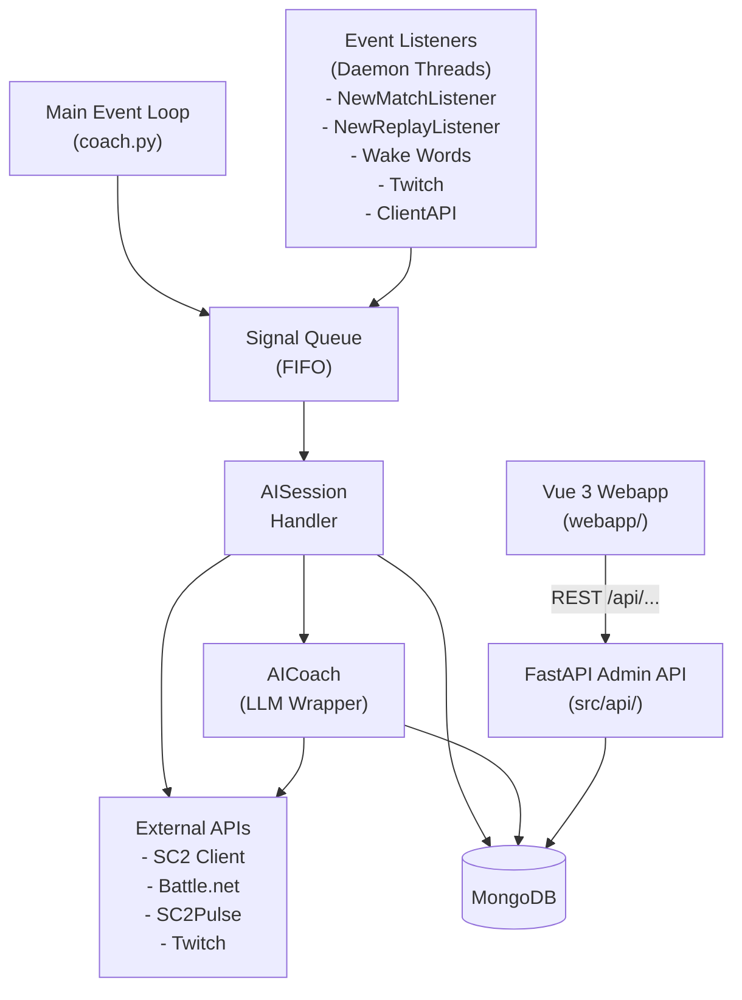
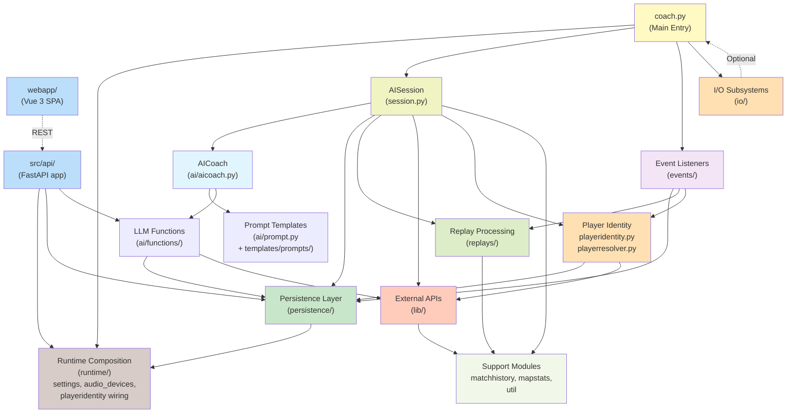
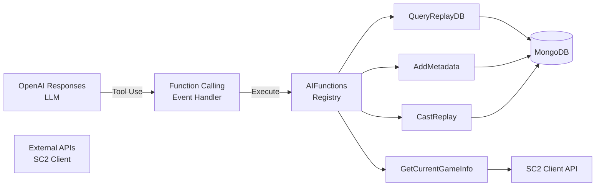
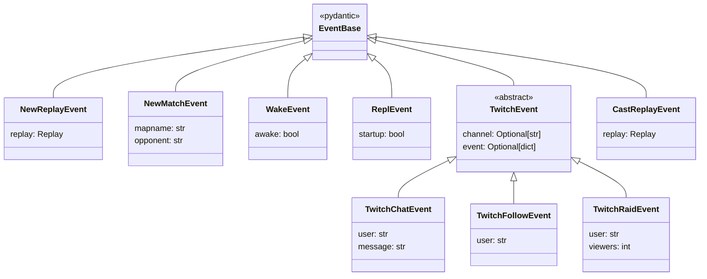
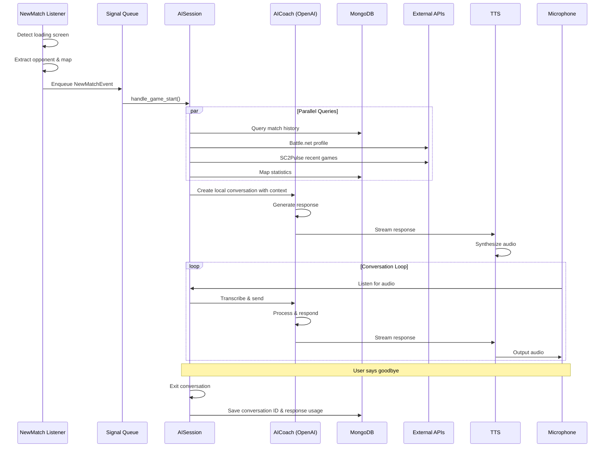
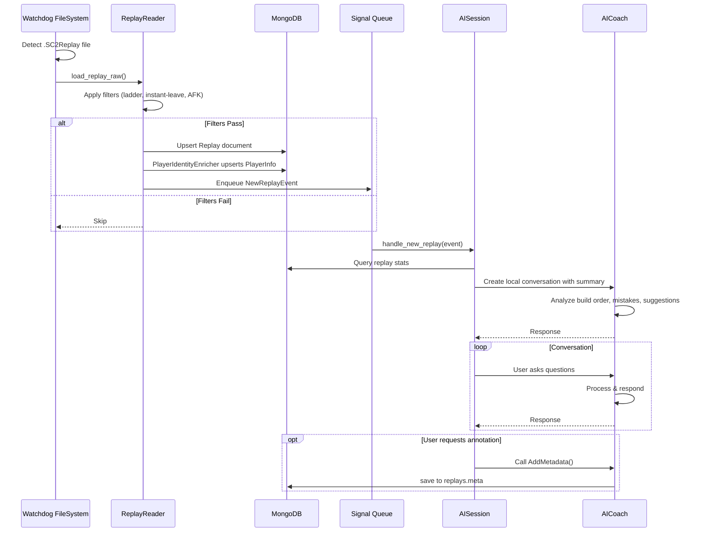
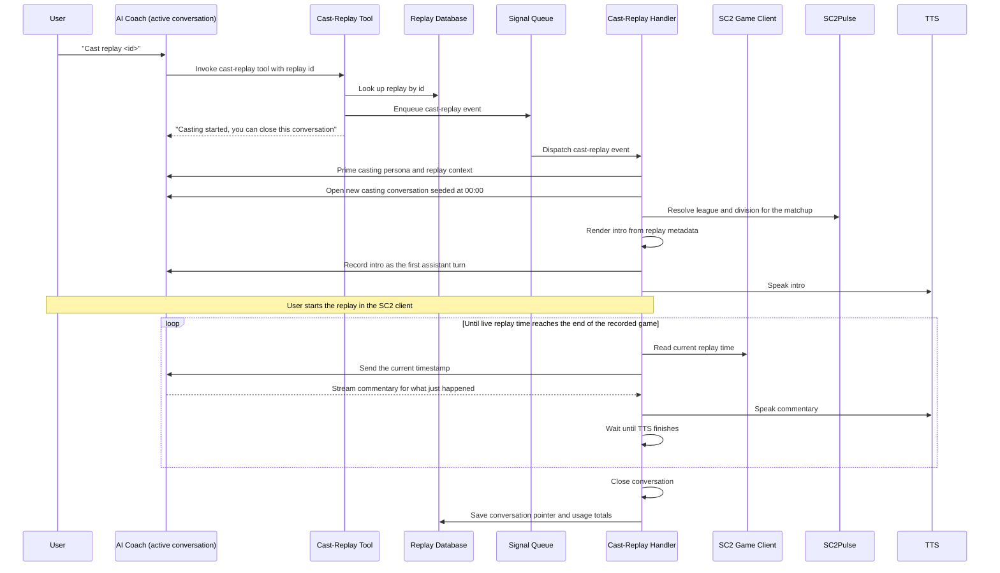
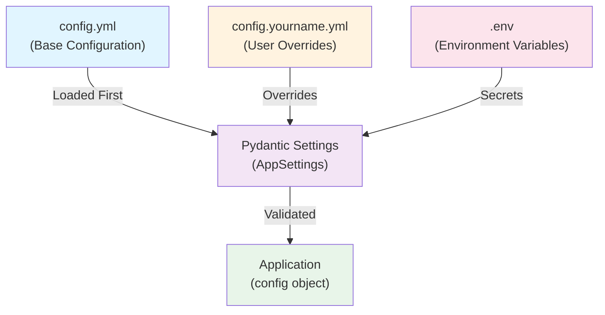

# SC2 AI Coach - Architecture Documentation

## Overview

SC2 AI Coach is an LLM-powered conversational coaching system for StarCraft II players. It provides real-time voice and text interactions, analyzing game replays and opponent data to offer strategic insights during gameplay sessions. The project is a research prototype exploring LLM-based agents in competitive gaming contexts.

In addition to the live coach process, the project ships a standalone admin surface: a FastAPI backend in `src/api/` and a Vue 3 single-page app in `webapp/` for inspecting and editing the MongoDB-backed domain data (replays, players, sessions, conversations, metadata, map stats).

**Version**: 0.6.0
**Language**: Python 3.12+
**Primary Frameworks**: OpenAI SDK Responses API via a shared sync client provider, Pydantic, PyODMongo, FastAPI (admin API), Vue 3 + Vite (admin webapp)
**Deployment**: Local development with optional voice I/O and streaming integrations. A `deploy/` directory packages the API + webapp + MongoDB as a docker-compose stack.

---

## System Architecture

### High-Level Design

The system runs as two cooperating processes that share the same MongoDB and the same domain models:

1. **Live coach** (`coach.py`) — event-driven runtime where independent listeners monitor triggers (game start, replay completion, voice activation, Twitch events) and place tasks into a shared queue. A main session handler processes these tasks sequentially, orchestrating LLM interactions and maintaining conversation state.
2. **Admin API + webapp** (`python -m src.api` + `webapp/`) — FastAPI service exposing CRUD and query routes for the persisted domain models. It runs without the coach runtime, replay watcher, voice stack, OBS integration, or OpenAI loop, and serves the built Vue 3 SPA from `webapp/dist/` at `/`.



### Core Components

**Module Dependency Graph**:



#### 1. Main Entry Point: `coach.py`
**Responsibility**: Application initialization and main event loop

- Loads runtime settings via the explicit loader `src.runtime.settings.get_config()`
- Builds shared infrastructure through composition helpers: `build_persistence_services(settings)` and `build_player_identity_services(settings, replay_store=...)`
- Initializes I/O subsystems (TTS, microphone, transcriber) based on audio mode configuration
- Spawns event listener threads for configured coach events (each implements the `LiveEventListener` Protocol in `src/contracts.py`)
- Creates an `AISession` instance to manage conversation state, injecting persistence stores and the player resolver
- Implements main infinite loop that pulls tasks from `signal_queue` and dispatches to session handlers
- Handles graceful shutdown of all listener threads

**Configuration-driven setup**:
- Audio modes (`AudioMode` enum): `text`, `in`, `out`, `full`
- Coach events (`CoachEvent` enum): `wake`, `game_start`, `new_replay`, `twitch`
- AI backend: OpenAI (or any OpenAI-compatible endpoint normalized by `src.ai.openai_provider`)
- `--repl` flag enqueues a `ReplEvent` so the app starts a text-only chat conversation immediately
- `--trace` flag turns on full LLM request/response trace dumps to debug logs

#### 2. Session Management: `src/session.py`
**Responsibility**: Orchestrates conversation sessions and event handling

**Key Class: `AISession`**
- Maintains conversation state: active local conversation ID, current Twitch chat conversation ID, last opponent, last map, MMR estimates
- Records session metadata via `SessionStore` (token usage and cost totals, list of conversations, current Twitch conversation pointer)
- Receives injected dependencies: `ConversationStore`, `ReplayStore`, `SessionStore`, and a `PlayerResolver`
- Implements handlers for each event type, dispatched through `self.handlers` (a `dict[type, Callable]`):
  - `handle_game_start()` - New ladder match detected (`NewMatchEvent`)
  - `handle_new_replay()` - Game just completed (`NewReplayEvent`)
  - `handle_wake()` - Voice or hotkey activation (`WakeEvent`)
  - `handle_repl()` - Startup REPL mode (`ReplEvent`)
  - `handle_twitch_chat()` - Twitch chat message (`TwitchChatEvent`)
  - `handle_twitch_follow()` - New follower event (`TwitchFollowEvent`)
  - `handle_twitch_raid()` - Incoming raid (`TwitchRaidEvent`)
  - `handle_cast_replay()` - Cast a replay (`CastReplayEvent`)

**Handler Pattern**:
Each handler typically:
1. Grounds LLM context with event-specific data (opponent info, replay summary, etc.) via Jinja2 templates
2. Initiates a new local conversation or, for Twitch chat, reuses the long-lived `twitch_conversation_id` so follow-up questions retain history
3. Manages conversation loop (user input → LLM → response), driven by `converse()` (interactive) or `stream_conversation()` (one-shot streamed answer)
4. Exits upon conversation completion and calls `calculate_usage()` to refresh persisted token/cost totals
5. For `handle_new_replay`, also calls `save_replay_summary()` which uses a structured-output LLM call to upsert a `Metadata` doc with description and tags

#### 3. AI Integration: `src/ai/`

**`aicoach.py`**: Wrapper around stateless OpenAI Responses calls
- Obtains its SDK client from `src.ai.openai_provider.get_openai_client()` unless a test injects a client explicitly
- Owns the local conversation lifecycle backed by MongoDB through `src.persistence.conversation_store.ConversationStore`
- Replays persisted messages, function calls, and function outputs on each Responses request with `store=False`
- Implements non-streaming chat, streaming chat, tool execution loops, structured outputs, tracing, and response usage/cost persistence

**`openai_provider.py`**: Shared sync OpenAI SDK client provider
- Centralizes construction of the project's `OpenAI` client so application code and reusable tests do not create SDK clients directly
- Reads `openai_endpoint`, `openai_api_key`, and `openai_org_id` from `config.py`
- Reuses the SSL context from `shared.py` for SDK HTTP transport verification
- Normalizes the SDK base URL to `https://api.openai.com/v1/` for the default OpenAI API or `{openai_endpoint}/openai/v1/` for custom endpoints
- Applies endpoint-specific authorization through an `httpx` request hook: `Authorization: Bearer ...` for default OpenAI and `api-key: ...` for custom/Azure-style endpoints
- Caches the sync SDK client and HTTP client until the provider is closed

**`prompt.py`**: Jinja2 template management
- Templates stored in `templates/prompts/` (project root) and loaded by the `Templates` singleton in `src/ai/prompt.py`
- Context-aware prompt generation for different scenarios:
  - `new_game.jinja2`, `new_game_empty.jinja2`, `rematch.jinja2` - Match start contexts
  - `new_replay.jinja2`, `summary.jinja2` - Post-game analysis
  - `twitch_chat.jinja2`, `twitch_follow.jinja2`, `twitch_raid.jinja2`, `init_twitch.jinja2` - Twitch interactions
  - `cast_replay.jinja2`, `cast_intro.jinja2` - Replay casting
  - `initial_instructions.jinja2`, `additional_instructions.jinja2` - System / developer prompts

**`pricing.py`**: Model pricing
- `ModelPricing` and `ModelPricingOverride` Pydantic models
- `get_default_model_pricing()` returns built-in per-million prompt/cached-prompt/completion prices for known models
- `normalize_model_name()` for matching pricing keys regardless of suffix
- Used by `Config.get_model_pricing()` and `Session` to compute live token cost totals

**`utils.py`**: Small helpers (tag normalization, JSON repair)

**`functions/`**: LLM-callable tools (function calling)
- `base.py` - shared base class, `strict_json_schema()` helper
- `QueryReplayDB.py` - Search historical replays (factory: `build_query_replay_db_function`)
- `GetCurrentGameInfo.py` - Query live SC2 client state
- `AddMetadata.py` - Annotate replays with coach comments (factory: `build_add_metadata_function`)
- `CastReplay.py` - Generate play-by-play commentary (factory: `build_cast_replay_function`)
- `AddPlayerTags.py`, `LookupPlayer.py` - present in the tree but **not** in the active registry

The active tool registry is assembled by `build_ai_functions(replay_store)` in `src/ai/functions/__init__.py` and currently exposes `QueryReplayDB`, `AddMetadata`, `GetCurrentGameInfo`, and `CastReplay`. The admin API exposes the current tool schema set at `GET /api/tools` for inspection.

**LLM Function Call Architecture**:



#### 4. Event Listeners: `src/events/`

All listeners conform to the `LiveEventListener` Protocol (`start`/`stop`/`join`) and produce events declared in `src/events/events.py`:

**`newreplay.py`**: `NewReplayListener`
- Uses `watchdog` to monitor the replay folder for new `.SC2Replay` files
- Parses replay with `sc2reader` + plugins
- Applies filters (ladder only, no instant-leaves, no AFK players)
- Saves replay through the injected `ReplayStore`
- Calls the injected `PlayerIdentityEnricher` to upsert opponent player info from the replay (portraits, aliases)
- Enqueues `NewReplayEvent`

**`loading_screen.py`**: `NewMatchListener`
- Uses OpenCV + Tesseract OCR to detect SC2 loading screen captured by OBS
- Extracts opponent name and map name from screenshots
- Enqueues `NewMatchEvent`
- Selected when `obs_integration` is enabled

**`clientapi.py`**: `ClientAPIListener`
- Polls the SC2 client API to detect when a new match starts (used when OBS integration is disabled)
- Enqueues `NewMatchEvent`

**`wake_*.py`**: Wake activation implementations
- `wake_key.py` - Keyboard hotkey (default `Ctrl+Alt+W`); also the wake-up path for non-voice modes
- `wake_livekit.py` - Continuous mic capture (16 kHz, 80 ms frames) into a rolling ~2 s buffer scored by a `livekit-wakeword` ONNX model. Emits a `WakeEvent` when any model output crosses `wakeword.threshold`, with a 2 s debounce window to suppress double-fires
All enqueue `WakeEvent`. The previous Picovoice Porcupine and OpenWakeWord backends have been retired

**`twitch.py`**: `TwitchListener`
- Uses `twitchAPI` for EventSub websocket
- Subscribes to: chat messages, follows, raids
- Supports a `mocked` mode for tests (`TwitchConfig.mocked` + `mocked_user_id`)
- Enqueues `TwitchChatEvent`, `TwitchFollowEvent`, `TwitchRaidEvent`

**Event Type Hierarchy**:



#### 5. I/O Subsystems: `src/io/`

**`tts.py`**: Text-to-Speech
- Uses `RealtimeTTS` library
- Supports engines: Kokoro (neural), System (OS default)
- Streaming output with configurable voice and speed
- Markdown stripping for clean speech

**`transcribe_whisper.py`, `transcribe_qwen.py`, `transcribe_xai.py`**: Speech-to-Text backends
- Selected via `TranscriberBackend` enum (`whisper`, `canary_qwen`, `xai`)
- Whisper/Qwen paths use local model inference where configured
- xAI path posts audio to a remote STT endpoint (`xai_api_key`, `xai_stt_language`)
- GPU acceleration (CUDA) when available
- Voice Activity Detection (WebRTC VAD) for noise filtering
- Downsampling from 44.1kHz to 16kHz

**`mic.py`**: Microphone Input
- Uses `speech_recognition` library
- Configurable energy threshold and pause detection
- Ambient noise adjustment
- Device index resolved via `src/runtime/audio_devices.py` (auto-picks a preferred device if `microphone_index` is not set)

**`rich_log.py`**: Console output handler
- Custom logging handler using Rich library for formatted terminal output
- Includes a hacky way to stream output to the terminal through logging and rich

**`dummy.py`**: `TTSDummy` no-op TTS used when voice output is disabled

**Contracts**: `src/contracts.py` defines abstract Protocols (`TTSService`, `MicrophoneService`, `TranscriberService`, `LiveEventListener`). `AISession` falls back to in-file dummy implementations (`DummyTTSService`, `DummyMicrophoneService`, `DummyTranscriberService`) when no real service is injected, so the session is always usable in text/REPL mode.

#### 6. Persistence Layer: `src/persistence/`

**`database.py`**: MongoDB abstraction
- `MongoDatabaseConfig` (frozen Pydantic model, `from_config(app_config)` factory)
- `MongoDatabase` lazy-builds a `pyodmongo` `DbEngine` and exposes `.engine`, `.raw` (pymongo client), and `.close()`
- Still ships legacy ambient accessors (`get_database`, `set_database`, `reset_database`) for test paths that have not migrated yet

**`runtime.py`**: Persistence composition
- `PersistenceServices` (frozen dataclass) bundles `database`, `replay_store`, `conversation_store`, `session_store`
- `build_persistence_services(settings)` constructs the full set in one call; used by `coach.py`, `repcli.py`, and the API lifespan

**`replay_store.py`**: Replay and player persistence
- Collections: `replays`, `replays.meta`, `players`
- Upsert logic for replay metadata and player information
- Pagination, projection, and admin-facing list/query helpers consumed by the API routers
- Hosts the persisted domain models `Replay`, `Metadata`, `PlayerInfo`, `Alias`

**`session_store.py`**: Session persistence
- Stores session-level conversation pointers, the current Twitch conversation pointer, and per-model pricing snapshots used to compute token/cost totals

**`conversation_store.py`**: Local AI conversation persistence
- Stores `AIConversation`, `AIConversationItem`, and `AIResponseRecord`
- Provides ordered local transcript replay for stateless Responses calls
- Exposes admin list/query helpers (`list_response_record_resources`, pagination, sort) used by the API responses router

#### 7. Replay Processing: `src/replays/`

**`reader.py`**: Replay parsing
- Wraps `sc2reader` library with custom plugins
- Plugins: APMTracker, WorkerTracker, SQTracker, CreepTracker
- Custom plugins: ReplayStats, SpawningTool (build order extraction)
- Converts raw replay objects to typed Pydantic models
- Filtering pipeline: ladder only, excludes instant-leaves, excludes AFK

**`types.py`**: Data models
- `Replay` - Complete replay data (500+ lines of nested structures)
- `PlayerInfo` - Opponent profile and statistics
- `Session` - Coaching session metadata
- `Metadata` - Coach annotations on replays
- `AIConversation`, `AIConversationItem`, `AIResponseRecord` - Local conversation state and usage records
- Custom validators for ToonHandle, ReplayId
- BSON Binary support for portrait images

**`plugins/`**: Custom sc2reader plugins
- Extract additional statistics not in base library

#### 8. External API Integrations: `src/lib/`

**`battlenet.py`**: Battle.net API
- Profile lookup by toon ID
- Portrait image download
- Career statistics (wins, best finish, etc.)
- Uses `blizzardapi2` wrapper
- Requires OAuth2 credentials

**`sc2pulse.py`**: SC2Pulse API
- Match history retrieval
- MMR and rank lookup
- "Unmask barcode" functionality (identify anonymous players)
- Character and account linking
- Division/league resolution

**`sc2client.py`**: StarCraft II Client API
- HTTP API exposed by running SC2 client
- Query active UI screens
- Retrieve in-game information
- Player names, races, game time


#### 9. Player Identity

The previous monolithic `src/playerinfo.py` has been split into two focused modules:

**`src/playeridentity.py`**:
- `PlayerPortraitSource` - loads OBS portrait screenshots, matches them by map + timestamp, and constructs framed portraits from Battle.net avatars
- `PlayerIdentityEnricher` - given a parsed replay, upserts a `PlayerInfo` row (portraits, aliases, name); raises `PlayerIdentityEnrichmentError` on failure
- Used by `NewReplayListener` during ingestion

**`src/playerresolver.py`**:
- `PlayerResolver.resolve_player(opponent, mapname, mmr)` runs the three-step opponent identification pipeline used by `AISession.handle_game_start`:
  1. Resolve by exact name in `PlayerInfo`
  2. Resolve by portrait via fast SSIM against stored portraits, including a special "barcode + Kat portrait" guard
  3. Resolve via SC2Pulse "unmask barcode" search
- `PlayerInfo` records are returned for downstream replay / match-history lookup

**`src/runtime/playeridentity.py`** wires both classes (and a shared `PlayerPortraitSource`) into a `PlayerIdentityServices` dataclass via `build_player_identity_services(settings, replay_store=...)`.

#### 10. Supporting Modules

**`src/matchhistory.py`**: Historical match data
- Aggregates match history from SC2Pulse
- Generates CSV exports
- MMR tracking over time

**`src/mapstats.py`**: Map statistics
- Aggregates student's performance per map
- Win rates, common opponents
- Race matchup statistics

**`src/util.py`**: Utility functions
- Time formatting
- Markdown stripping
- Barcode pattern detection
- File waiting logic

**`src/runtime/settings.py`** (was `config.py` at the repo root): Configuration management
- Pydantic Settings with YAML file layering and `.env` source ordering
- Multi-file config support (`config.*.yml`)
- Type-safe configuration models for student, audio, TTS, wake word, Twitch, recognizer, model pricing overrides, etc.
- Defines enums: `AudioMode`, `CoachEvent`, `AIBackend`, `TranscriberBackend`, `SC2Region`
- Embeds the API-only `ApiConfig` under `config.api` (host, port, `web_dist_dir`, mongo connect timeout)
- Exposes `load_current_settings(require_prepared_environment=True)` and `load_api_settings()` (no env preparation required); `get_config()` caches a process-wide instance for legacy code paths
- Provides OpenAI SDK configuration consumed by `src.ai.openai_provider`: `openai_endpoint`, `openai_api_key`, `openai_org_id`

**`src/runtime/audio_devices.py`**: Helper to auto-select a preferred microphone when `microphone_index` is unset.

**`shared.py`**: Shared global state
- `signal_queue`: Thread-safe task queue
- `http_client`: Shared httpx client for connection pooling
- `ctx`: shared SSL context based on Certifi, reused by the OpenAI SDK provider and shared HTTP client
- `REGION_MAP`: Battle.net region/realm mappings

**`log.py`**: Logging setup
- Application-wide logger configuration via `configure_application_logging()`

#### 11. Admin API: `src/api/`

A standalone FastAPI application for inspecting and editing the persisted domain data. It runs without the coach runtime, voice stack, OBS, or OpenAI loop, and is the backend that powers the admin webapp. See `docs/spec/api.md` for the full design direction; ADR 0001 (`docs/adr/0001-eliminate-ambient-runtime-state.md`) sets the no-ambient-state rule the API follows.

**`app.py`**: `create_app(settings_loader, persistence_builder)` builds the FastAPI app
- Lifespan loads settings via `load_api_settings()` and stores `PersistenceServices` on `app.state`
- Registers exception handlers that emit a uniform `{"error": {...}}` envelope
- Includes the routers below plus the SPA fallback router

**`__main__.py`**: `python -m src.api` runs uvicorn on `config.api.host:config.api.port` (default `127.0.0.1:8765`)

**`config.py`**: `ApiConfig` model (host, port, `web_dist_dir`, mongo connect timeout) embedded under `Config.api`

**`state.py`**, **`errors.py`**, **`models.py`**, **`validation.py`**: Request-scoped dependency accessors, the shared error envelope helpers (`raise_api_error`, `json_error`, resource-specific 404s), API-only response models (`HealthResponse`, `PlayerInfoResponse`, `ReplayPlayerRelationship`, `QueryRequest`, `ErrorBody`, `ErrorResponse`), and projection/sort/filter/patch validators.

**`webapp.py`**: Serves the built Vue SPA from `Config.api.web_dist_dir` (default `webapp/dist`). Falls back to `index.html` for client-side routes, returns a structured 503 (`webapp_not_built`) when the build is missing.

**`routers/`**: One module per route family. All paths are prefixed with `/api/`:
- `health` - `GET /api/health` (pings MongoDB)
- `replays` - list/detail/CRUD over `Replay`, plus `/api/replays/query`
- `metadata` - CRUD over `Metadata` (coach annotations on replays)
- `players` - CRUD over `PlayerInfo` including portrait asset routes and alias-portrait routes
- `sessions` - list/detail of coaching sessions and their linked conversations
- `conversations` - CRUD over `AIConversation`; append-item route
- `conversation_items` - read-only list/detail of `AIConversationItem`
- `responses` - read-only list/detail of `AIResponseRecord` with `by-response-id` lookup
- `map_stats` - aggregation-backed reporting surface
- `tools` - `GET /api/tools` returns the current Responses tool schemas

The API never accesses MongoDB directly; it reuses the persistence stores and may extend them when new admin lookups are needed.

#### 12. Admin Webapp: `webapp/`

Vue 3 + Vite SPA, served at `/` by the API. Source under `webapp/src/` with a route registry, views per resource family, and an incremental component library under `webapp/src/components/` (e.g. `CrudPanel`, `ResourceInboxControls`, `ToolCallCard`, `MarkdownRenderer`). Tests use Vitest. See `docs/spec/webapp.md` for design direction.

The webapp is a thin API client: domain-shaped routes (`/replays/:id`, `/sessions/:id`, ...) map onto the documented API route families. Writable flows are exposed only for the resource families where the API supports them (`replays`, `metadata`, `players`, `conversations`); `sessions`, `conversation-items`, and `responses` are read-only.

#### 13. Runtime Composition: `src/runtime/`

Following ADR 0001, the project removed ambient runtime state. Instead of import-time globals, entrypoints (`coach.py`, `repcli.py`, `src/api/app.py`, tests) call explicit composition helpers:

- `src/runtime/settings.py` - `Config`, `load_current_settings`, `load_api_settings`, `get_config`
- `src/persistence/runtime.py` - `build_persistence_services(settings)`
- `src/runtime/playeridentity.py` - `build_player_identity_services(settings, replay_store=...)`
- `src/runtime/audio_devices.py` - microphone auto-selection

These helpers return frozen dataclasses (`PersistenceServices`, `PlayerIdentityServices`) that the entrypoints then inject into long-lived objects like `AISession`, `AICoach`, and the FastAPI app state.

---

## Data Flow

### Example Flow: New Game Started



1. **Detection**: `NewMatchListener` (or `ClientAPIListener` when OBS is off) detects a new match
2. **Extraction**: Extracts opponent name "PlayerX" and map "Goldenaura LE"
3. **Queueing**: Creates `NewMatchEvent(opponent="PlayerX", mapname="Goldenaura LE")` and puts in `signal_queue`
4. **Dispatch**: Main loop retrieves event, calls `session.handle(task)`
5. **Handler Invocation**: `session.handle_game_start(event)` is called
6. **Opponent Resolution**: `PlayerResolver.resolve_player(opponent, map, mmr)` runs name → portrait (SSIM) → SC2Pulse pipeline
7. **Context Gathering**: Handler queries:
   - Last games against the resolved opponent from MongoDB
   - The opponent's recent match history from SC2Pulse
   - Map statistics from database
8. **LLM Grounding**: Renders `rematch.jinja2` (if the same opponent was just played), `new_game.jinja2`, or speaks `new_game_empty.jinja2` when no context exists
9. **Conversation Creation**: Creates a new local conversation with the grounding message
10. **LLM Interaction**: Streams assistant response, feeding to TTS
11. **Conversation Loop**: Listens for mic input, transcribes, sends to LLM, repeats
12. **Termination**: User says "goodbye" or similar, handler exits
13. **Session Recording**: Conversation ID and response usage totals are saved to MongoDB

### Example Flow: Replay Analysis



1. **Detection**: `NewReplayHandler` (watchdog) detects new `.SC2Replay` file
2. **Parsing**: `sc2reader` loads and processes replay with all plugins
3. **Filtering**: Checks ladder/instant-leave/AFK filters
4. **Database Insert**: Upserts `Replay` document to MongoDB
5. **Player Info**: `PlayerIdentityEnricher.save_from_replay()` upserts opponent `PlayerInfo` (portraits, aliases)
6. **Event Creation**: `NewReplayEvent(replay=replay)` queued
7. **Handler**: `session.handle_new_replay(event)` called
8. **Analysis**: Handler provides replay summary to LLM (game duration, result, key stats)
9. **Conversation**: LLM discusses build orders, mistakes, suggestions
10. **Replay summary**: After the conversation ends, `save_replay_summary()` requests a structured summary (`description` + `tags`) and upserts it via the `Metadata` model
11. **Annotation**: User might also ask the LLM to "add comment" which calls the `AddMetadata` function during the conversation
12. **Persistence**: Metadata saved to `replays.meta` collection

### Example Flow: Cast Replay

Cast replay is started indirectly: the user asks the coach (in any existing conversation) to cast a specific replay. The coach invokes the cast-replay tool, which enqueues a cast-replay event. The main loop then dispatches it like any other event, but the cast-replay handler runs a tight loop synchronized with the live SC2 client clock instead of listening to the microphone.



1. **Trigger**: User asks the coach to cast a replay during an existing conversation (typically launched via wake or REPL).
2. **Tool call**: The coach invokes the cast-replay tool with a replay identifier. The tool accepts either the replay's filehash or the leading digits of its unix timestamp.
3. **Lookup**: The replay store resolves the replay document.
4. **Event**: A cast-replay event is put on the signal queue and the originating conversation can be closed.
5. **Handler**: The main loop dispatches the cast-replay handler.
6. **Developer instructions**: The full replay (build order, key events, units lost, stats) is primed onto the coach as developer instructions so every subsequent turn carries the casting persona and the complete replay context.
7. **New conversation**: A fresh local conversation is opened, seeded at game time 00:00.
8. **Intro**: League and division are resolved from SC2Pulse, and a deterministic intro (student and opponent names, races, colors, starting positions, map, matchup, league) is rendered from the replay metadata. The intro is recorded as the first assistant turn and spoken via TTS.
9. **Sync to live client**: While the intro plays, the student starts the in-game replay in the SC2 client. The handler then polls the SC2 client API for the current replay time. The coach has no direct access to the game client — the polled time is the only signal it gets that the game is progressing.
10. **Commentary loop**: For every tick, the handler sends only the current replay timestamp to the coach. Because the coach was primed with the full replay (build order, events, stats), it cross-references the timestamp against that data and generates commentary for what is happening in the game at that moment — effectively pretending to watch the game alongside the user. The streamed response is fed to TTS, and the loop waits for TTS to finish before the next tick to avoid overlapping speech.
11. **Termination**: The loop exits when the live replay time reaches the end of the recorded game.
12. **Cleanup**: The handler closes the casting conversation, refreshes usage and cost totals on the session, and records the conversation pointer.


---

## Key Technologies & Dependencies

Authoritative version pins live in `pyproject.toml`. The lists below are grouped by role.

### Core Libraries
- **LLM**: `openai` - OpenAI SDK accessed through `src.ai.openai_provider`; all model calls use stateless Responses requests backed by local MongoDB conversation state
- **Database**: `pyodmongo` - Pydantic ODM for MongoDB
- **Replay Parsing**: `sc2reader` (ggtracker `upstream`), `sc2reader-plugins`, `spawningtool`
- **Configuration**: `pydantic`, `pydantic-settings`, `pyyaml`
- **HTTP**: `httpx` - shared sync `httpx.Client` for connection pooling and SSL
- **CLI**: `click`
- **Rich Output**: `rich`, `tabulate`, `climage`
- **Web API**: `fastapi`, `uvicorn` - admin API and webapp host

### Webapp
- **Framework**: `vue@^3.5`, `vue-router@^4.6`, `vite@^7`
- **Rendering**: `markdown-it`, `vue-json-pretty`
- **Tests**: `vitest`

### Voice I/O (Optional Dependencies)
- **TTS** (`standard` extra): `realtimetts` with Kokoro engine
- **STT** (`whisper` extra): `transformers`, `speechrecognition`
- **Audio** (`standard` extra): `pyaudio`, `soundfile`
- **ML**: `torch`, `torchaudio` - CUDA 12.4 channel
- **Wake Words** (`livekit` extra): `livekit-wakeword` running a local ONNX model
- **VAD** (`whisper` extra): `webrtcvad`

### External Services
- **Battle.net**: `blizzardapi2`
- **Twitch**: `twitchapi`
- **Computer Vision**: `opencv-python`, `tesserocr` (custom Windows wheel for cp312)
- **OBS**: `obsws-python`

### Development
- **Testing**: `pytest`, `pytest-mock`, `pytest-cov`, `parametrize-from-file`, `respx`, `testcontainers[mongodb]`
- **Linting**: `ruff`, `pre-commit`
- **Type Checking**: `pyright` (standard mode, project config in `pyproject.toml`)
- **Package Manager**: `uv`

---

## Configuration System

### Configuration Layering



### Multi-Layer YAML Configuration
Base configuration in `config.yml`, overridden by `config.*.yml` files (e.g., `config.zatic.yml`).

**Key Settings**:
```yaml
# Student (user) configuration
student:
  name: "PlayerName"
  race: "Terran"
  emoji: ":robot:"

# Paths
replay_folder: "C:\\...\\Replays\\Multiplayer"

# Database
db_name: "sc2coach"

# AI Configuration
aibackend: "OpenAI"
gpt_model: "gpt-5.4"
openai_endpoint: null  # optional; custom endpoints normalize to {endpoint}/openai/v1/
reasoning_effort: "medium"
reasoning_continuity_enabled: false
# Audio Configuration
audiomode: "full"  # text | in | out | full
speech_recognition_model: "openai/whisper-large-v3"
transcriber_backend: "whisper"  # whisper | canary_qwen | xai
wakeword:
  engine: "livekit"
  model_path: "external/livekit/hey_coach.onnx"
  threshold: 0.55
tts:
  engine: "kokoro"
  voice: "af_sky"
  speed: 1.15

# Event Listeners
coach_events:
  - wake
  - game_start
  - new_replay
  - twitch

# Admin API
api:m
  host: "127.0.0.1"
  port: 8765
  web_dist_dir: "webapp/dist"

# Feature Flags
obs_integration: true
interactive: true
```

### Environment Variables
Secrets in `.env` file (Pydantic Settings reads them with the `AICOACH_` prefix and `__` nested delimiter):
- `AICOACH_MONGO_DSN` - MongoDB connection string
- `AICOACH_OPENAI_API_KEY` - OpenAI API key used by the shared SDK client provider
- `AICOACH_OPENAI_ORG_ID` - OpenAI organization ID forwarded to the SDK client when configured
- `AICOACH_OPENAI_ENDPOINT` - Optional OpenAI-compatible endpoint. Empty/default values use `https://api.openai.com/v1/`; custom values are normalized to `{endpoint}/openai/v1/` and use `api-key` authorization
- `BLIZZARD_CLIENT_ID`, `BLIZZARD_CLIENT_SECRET` - Battle.net OAuth
- `AICOACH_TWITCH__CLIENT_ID`, `AICOACH_TWITCH__CLIENT_SECRET`, `AICOACH_TWITCH__CHANNEL` - Twitch integration credentials and target channel
- `AICOACH_TWITCH__MOCKED`, `AICOACH_TWITCH__MOCKED_USER_ID` - Optional Twitch mock integration settings
- `AICOACH_API__HOST`, `AICOACH_API__PORT` - Admin API bind address (used by `deploy/docker-compose.yml` to bind `0.0.0.0:8765`)

**Pydantic Settings**: `src/runtime/settings.py` defines `Config` using `pydantic-settings`. Source order is `init` → env vars → `.env*` → `file_secret_settings` → YAML files (`config*.yml` collected from the working directory).

---

## CLI Tools and Entrypoints

### `coach.py` - Live coach runtime
- `uv run coach.py` starts the full event-driven runtime
- `--repl` runs a text-only chat REPL (no listeners, no voice I/O); useful for development against MongoDB without SC2
- `--debug` enables debug logging
- `--trace` dumps full LLM request and response traces to debug logs

### `python -m src.api` - Admin API + webapp
- Runs uvicorn on `config.api.host:config.api.port`
- Serves the built Vue SPA from `webapp/dist/` at `/`
- OpenAPI: `/api/openapi.json`, docs at `/api/docs` and `/api/redoc`
- During webapp development, run `npm run dev` inside `webapp/` for a Vite dev server that proxies `/api/*` to `127.0.0.1:8765`

### `repcli.py` - Replay Database Management
Command-line tool for replay database operations:

**Commands**:
- `add` - Add one or more replays to MongoDB
- `echo` - Print a parsed replay from a `.SC2Replay` file
- `query players` - Query player information in MongoDB
- `sync` - Synchronize replay folder to MongoDB
- `validate` - Check replay files for parsing errors

**Options**:
- `--clean` - Delete instant-leave replays
- `--debug` - Verbose logging including sc2reader output
- `--simulation` - Dry-run mode
- `--verbose` - Additional output

**Key Functions**:
- Batch processing with progress bars (Rich)
- Portrait matching and construction
- Build order extraction via SpawningTool
- Player info aggregation

### `obs_client.py` - OBS Integration
Standalone process for OBS scene switching:
- Monitors SC2 client UI state via Client API
- Sends screen state to OBS AdvancedSceneSwitcher plugin
- Enables automatic scene switching (menus vs. in-game)

---

## Testing Infrastructure

### Test Organization: `tests/`

**Structure**:
- `unit/` - Unit tests for isolated components (including API routers, config, runtime composition, AI functions, player identity)
- `integration/` - Integration tests requiring external services or testcontainers; includes API integration tests (`test_api_*.py`) that exercise the full FastAPI app against a real MongoDB
- `llm/` - LLM interaction tests with recorded conversations
- `support/` - Shared test infrastructure: `fake_openai.py` (offline Responses client), `container_services.py`, `pytest_services.py`
- `testdata/` - Sample data files (portraits, replays)
- `conftest.py` - Pytest fixtures and configuration
- `mocks.py` - Mock objects for testing
- `critic.py` (file at tests root) - LLM-as-judge harness, obtains its SDK client from `src.ai.openai_provider.get_openai_client()`

Default unit coverage runs offline with the `fake_openai` Responses client; integration tests that touch MongoDB are gated by the `mongo` pytest marker and provisioned via `testcontainers[mongodb]`. Live LLM tests under `tests/llm/` remain opt-in.

**Mocking**:
- `pytest-mock` for dependency injection
- `respx` for HTTP mocking
- Mocked services for Twitch (built-in `mocked` mode), Battle.net, voice I/O
- OpenAI-facing tests can inject clients directly into `AICoach` or the critic; reusable code should default through `src.ai.openai_provider` rather than constructing `OpenAI(...)` inline
- `tests/unit/test_openai_provider.py` covers default-vs-custom endpoint normalization, SSL context reuse, authorization headers, and provider use by `AICoach` / the critic

---

## External Integrations

### StarCraft II Client API
- HTTP API on `http://localhost:6119`
- Endpoints: `/game`, `/ui`
- Provides: active screens, player info, game time

### Battle.net API
- OAuth2 flow via `blizzardapi2`
- Profile data: career stats, portrait, ladder rank
- Region-specific (US/EU/KR)
- Rate limited

### SC2Pulse Community Platform
- Public API, no authentication
- Character search, match history, MMR tracking
- Used for opponent intelligence gathering
- "Reveal barcode" algorithm to unmask anonymous accounts

### Twitch
- EventSub WebSocket for real-time events
- Chat bot functionality via `twitchAPI`
- OAuth User Authentication
- Events: chat, follows, raids

### OBS Studio
- WebSocket protocol via `obsws-python`
- Scene control and source visibility
- Screenshot capture automation
- AdvancedSceneSwitcher macro integration

---

## External Resources & Plugins

### `external/` Directory

**`fast_ssim/`**: Structural Similarity Index
- Fast SSIM implementation for image comparison
- Used for portrait matching
- License: MIT

**`livekit/`**: Wake Word Model
- `hey_coach.onnx` - LiveKit wake-word ONNX model used by `wake_livekit.py`

**`porcupine/`**: Legacy wake-word models
- `hey-coach_en_*.ppn` files left over from the previous Picovoice Porcupine integration; not loaded by the current runtime

### Modified Third-Party Libraries
Project uses forked/patched versions:
- `sc2reader` - From ggtracker upstream branch
- `sc2reader-plugins` - Custom fork with additional trackers
- `spawningtool` - Build order extraction from replays
- `tesserocr` - Windows wheel from custom build

---

## Project Structure Deep Dive

### `assets/` - Static Resources
- Portrait frames (diamond, etc.)
- Example screenshots for documentation
- Reference images (Katchinsky portrait)

### `logs/` - Runtime Logs
- Match history CSV exports
- Application logs
- OBS client logs

### `deploy/` - Container deployment
- `Dockerfile` - Two-stage build: Node 20 builds the Vue webapp into `webapp/dist`, then the `uv` Python image installs runtime deps and copies in the source. The container runs `python -m src.api` on port 8765
- `docker-compose.yml` - Runs MongoDB (`mongo:7`) and the API container together; configurable through `DB_PORT`, `APP_PORT`, `DB_NAME`, and the `AICOACH_OPENAI_*` env vars

### `webapp/` - Admin SPA source
- `src/` - Vue 3 + TypeScript source: `App.vue`, `router.ts`, `routes.ts`, `route-registry.ts`, per-resource modules (`replays.ts`, `players.ts`, `conversations.ts`, ...), shared components under `src/components/`, and per-resource views under `src/views/`
- Vitest test files colocated with sources (`*.test.ts`)
- `public/`, `unit_icon_map.json`, `vite.config.ts` (Vite dev proxy `/api` → `127.0.0.1:8765`)

### `templates/` - Jinja2 prompt templates
- `prompts/` - All AI coach prompt templates loaded by `src.ai.prompt.Templates`
- `map_stats.jinja2` - Map stats rendering helper

### `obs/screenshots/` - OBS Captures
- `portraits/` - Auto-captured opponent portraits from loading screen

### `playground/` - Experimental Code
- Jupyter notebooks for exploration
- Test scripts not in main codebase
- SSIM testing, Twitch integration experiments

### `docs/` - Documentation
- `architecture.md` - This file
- `adr/` - Architecture Decision Records (e.g. ADR 0001 on eliminating ambient runtime state)
- `agents/` - Agent and contributor process docs
- `spec/` - Component specs (`api.md`, `webapp.md`, `migrate-assistant.md`)
- `references/` - External library references (e.g. pyodmongo)

---

## Current Limitations & Known Issues

1. **Windows-Only listeners**: TesserOCR (for OCR-based loading-screen detection) and some wake word engines are Windows-specific
2. **GPU Dependency**: Optimal performance requires CUDA GPU for Whisper and TTS
3. **Single Region**: Configured for one Battle.net region at a time
4. **No Auth on Admin API**: The FastAPI admin surface and webapp are intended for local use; there is no built-in authentication or authorization

