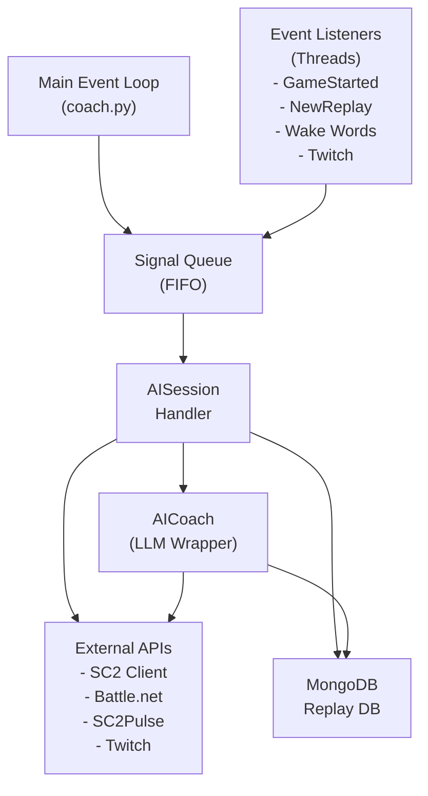
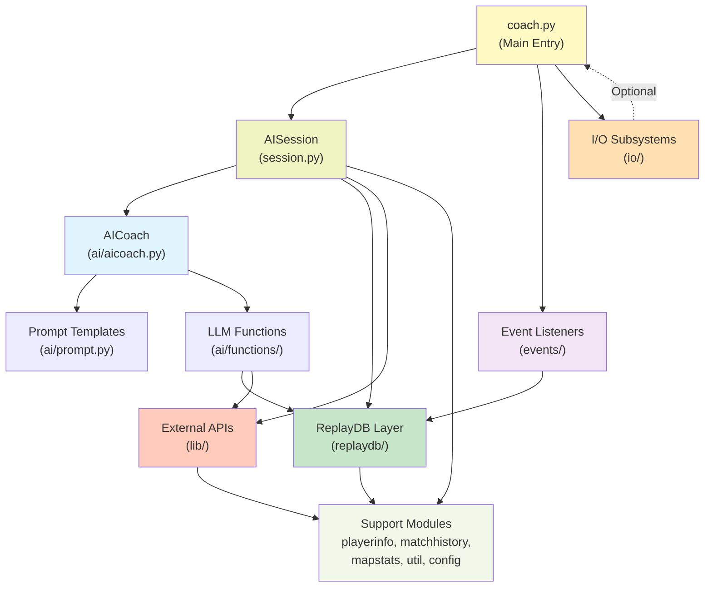
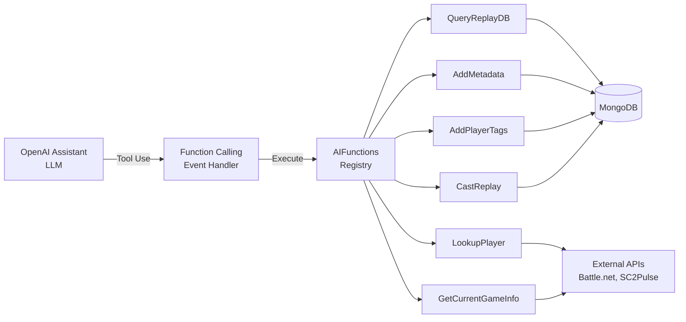
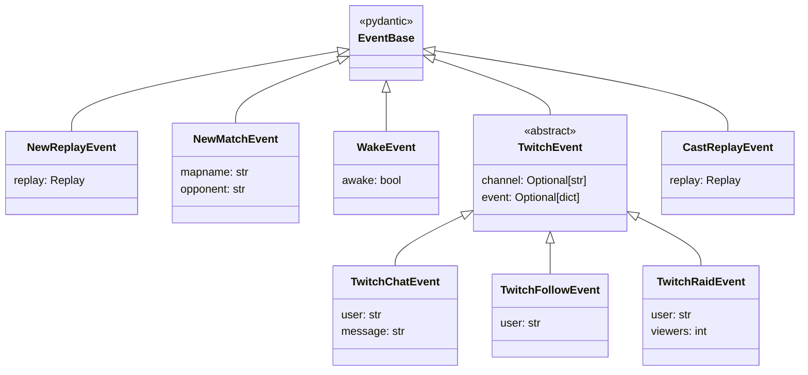
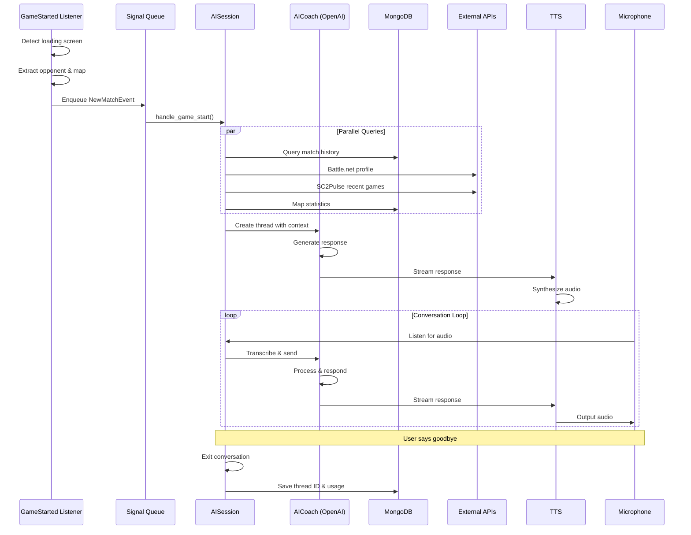
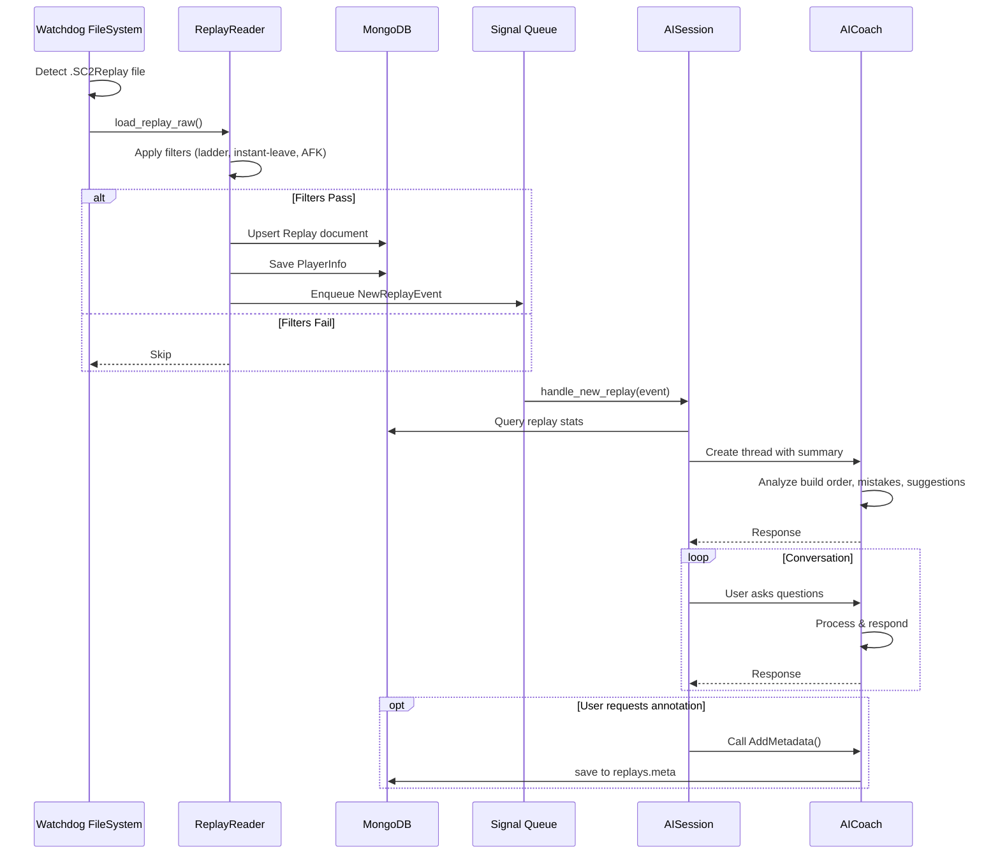
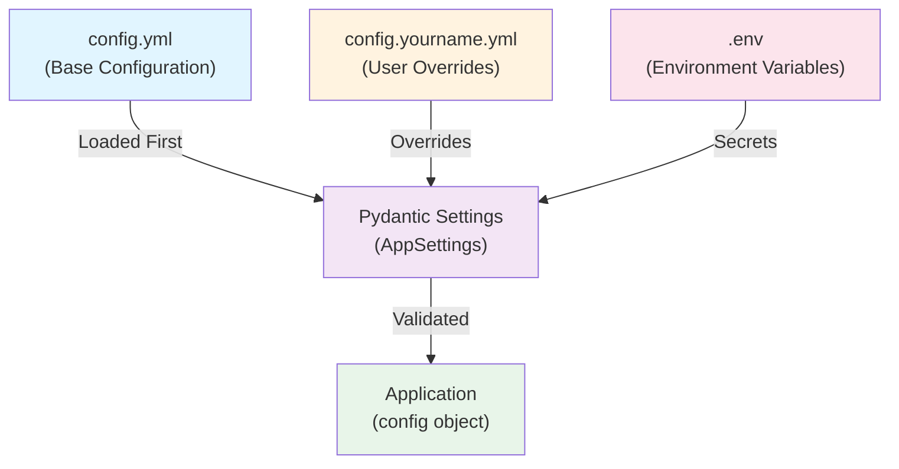

# SC2 AI Coach - Architecture Documentation

## Overview

SC2 AI Coach is an LLM-powered conversational coaching system for StarCraft II players. It provides real-time voice and text interactions, analyzing game replays and opponent data to offer strategic insights during gameplay sessions. The project is a research prototype exploring LLM-based agents in competitive gaming contexts.

**Version**: 0.6.0  
**Language**: Python 3.12+  
**Primary Frameworks**: OpenAI Assistants API, Pydantic, PyODMongo  
**Deployment**: Local development with optional voice I/O and streaming integrations

---

## System Architecture

### High-Level Design

The system follows an **event-driven architecture** where multiple independent listeners monitor various triggers (game start, replay completion, voice activation, Twitch events), placing tasks into a shared queue. A main session handler processes these tasks sequentially, orchestrating LLM interactions and maintaining conversation state.



### Core Components

**Module Dependency Graph**:



#### 1. Main Entry Point: `coach.py`
**Responsibility**: Application initialization and main event loop

- Initializes I/O subsystems (TTS, microphone, transcriber) based on audio mode configuration
- Spawns event listener threads for configured coach events
- Creates an `AISession` instance to manage conversation state
- Implements main infinite loop that pulls tasks from `signal_queue` and dispatches to session handlers
- Handles graceful shutdown of all threads

**Configuration-driven setup**:
- Audio modes: `text`, `voice_in`, `voice_out`, `full`
- Coach events: `wake`, `game_start`, `new_replay`, `twitch`
- AI backends: OpenAI (default), Mocked (testing)

#### 2. Session Management: `src/session.py`
**Responsibility**: Orchestrates conversation sessions and event handling

**Key Class: `AISession`**
- Maintains conversation state: active thread ID, last opponent, last map, MMR estimates
- Records session metadata in MongoDB including token usage and costs
- Implements handlers for each event type:
  - `handle_game_start()` - New ladder match detected
  - `handle_new_replay()` - Game just completed
  - `handle_wake()` - Voice activation trigger
  - `handle_twitch_chat()` - Twitch chat message
  - `handle_twitch_follow()` - New follower event
  - `handle_twitch_raid()` - Incoming raid
  - `handle_cast_replay()` - Request to cast a replay

**Handler Pattern**:
Each handler typically:
1. Grounds LLM context with event-specific data (opponent info, replay summary, etc.)
2. Initiates a new conversation thread or continues existing one
3. Manages conversation loop (user input → LLM → response)
4. Exits upon conversation completion

#### 3. AI Integration: `src/ai/`

**`aicoach.py`**: Wrapper around OpenAI Assistants API
- Manages Assistant configuration and thread lifecycle
- Implements streaming response handling
- Processes function calls from LLM (tool use)
- Tracks token usage per thread
- Event handling via custom `AssistantEventHandler`

**`prompt.py`**: Jinja2 template management
- Templates stored in `src/ai/prompts/`
- Context-aware prompt generation for different scenarios:
  - `new_game.jinja2` - Match start context
  - `new_replay.jinja2` - Post-game analysis
  - `twitch_chat.jinja2` - Twitch interaction context
  - `cast_replay.jinja2` - Replay casting

**`functions/`**: LLM-callable tools (function calling)
- `QueryReplayDB.py` - Search historical replays
- `LookupPlayer.py` - Fetch opponent Battle.net profile
- `GetCurrentGameInfo.py` - Query live SC2 client state
- `AddMetadata.py` - Annotate replays with coach comments
- `AddPlayerTags.py` - Tag opponents with characteristics
- `CastReplay.py` - Generate play-by-play commentary

All functions decorated with `@AIFunction` for automatic registration.

**LLM Function Call Architecture**:



#### 4. Event Listeners: `src/events/`

Each listener runs as a separate daemon thread:

**`newreplay.py`**: `NewReplayListener`
- Uses `watchdog` to monitor replay folder for new `.SC2Replay` files
- Parses replay with `sc2reader` + plugins
- Applies filters (ladder only, no instant-leaves, no AFK players)
- Saves replay to MongoDB
- Enqueues `NewReplayEvent`

**`loading_screen.py`**: `GameStartedListener`
- Uses OpenCV + Tesseract OCR to detect SC2 loading screen
- Extracts opponent name and map name from screenshots
- Enqueues `NewMatchEvent`

**`wake_*.py`**: Various wake word implementations
- `wake_key.py` - Keyboard hotkey (Ctrl+Shift+Q)
- `wake_porcupine.py` - Picovoice Porcupine wake word detection
- `wake_oww.py` - OpenWakeWord detection
All enqueue `WakeEvent`

**`twitch.py`**: `TwitchListener`
- Uses `TwitchAPI` for EventSub websocket
- Subscribes to: chat messages, follows, raids
- Enqueues corresponding Twitch events

**`clientapi.py`**: SC2 client API integration
- Uses StarCraft II Client API (HTTP) to query game state
- Not a standalone listener but provides game info on-demand

**Event Type Hierarchy**:



#### 5. I/O Subsystems: `src/io/`

**`tts.py`**: Text-to-Speech
- Uses `RealtimeTTS` library
- Supports engines: Kokoro (neural), System (OS default)
- Streaming output with configurable voice and speed
- Markdown stripping for clean speech

**`transcribe.py`**: Speech-to-Text
- Whisper model via HuggingFace Transformers
- GPU acceleration (CUDA) when available
- Flash Attention 2 optimization
- Voice Activity Detection (WebRTC VAD) for noise filtering
- Downsampling from 44.1kHz to 16kHz

**`mic.py`**: Microphone Input
- Uses `speech_recognition` library
- Configurable energy threshold and pause detection
- Ambient noise adjustment

**`rich_log.py`**: Console output handler
- Custom logging handler using Rich library for formatted terminal output
- Includes a hacky way to stream output to the terminal through logging and rich

**Contracts**: `src/contracts.py` defines abstract interfaces (`TTSService`, `MicrophoneService`, `TranscriberService`) with dummy implementations for non-voice modes.

#### 6. Database Layer: `src/replaydb/`

**`db.py`**: MongoDB abstraction
- Uses `pyodmongo` (Pydantic-based ODM)
- Collections: `replays`, `replays.meta`, `sessions`, `playerinfo`
- Custom upsert logic to handle custom ID fields
- Pagination support for large result sets

**`reader.py`**: Replay parsing
- Wraps `sc2reader` library with custom plugins
- Plugins: APMTracker, WorkerTracker, SQTracker, CreepTracker
- Custom plugins: ReplayStats, SpawningTool (build order extraction)
- Converts raw replay objects to typed Pydantic models
- Filtering pipeline: ladder only, excludes instant-leaves, excludes AFK

**`types.py`**: Data models
- `Replay` - Complete replay data (500+ lines of nested structures)
- `PlayerInfo` - Opponent profile and statistics
- `Session` - Coaching session metadata
- `Metadata` - Coach annotations on replays
- Custom validators for ToonHandle, ReplayId
- BSON Binary support for portrait images

**`plugins/`**: Custom sc2reader plugins
- Extract additional statistics not in base library

#### 7. External API Integrations: `src/lib/`

**`battlenet.py`**: Battle.net API
- Profile lookup by toon ID
- Portrait image download
- Career statistics (wins, best finish, etc.)
- Uses `blizzardapi2` wrapper
- Requires OAuth2 credentials

**`sc2pulse.py`**: SC2Pulse API
- Match history retrieval
- MMR and rank lookup
- "Unmask barcode" functionality (identify anonymous players)
- Character and account linking
- Division/league resolution

**`sc2client.py`**: StarCraft II Client API
- HTTP API exposed by running SC2 client
- Query active UI screens
- Retrieve in-game information
- Player names, races, game time


#### 8. Supporting Modules

**`src/playerinfo.py`**: Opponent profile management
- Constructs `PlayerInfo` records from multiple sources
- Matches portrait screenshots from OBS to replays
- Portrait construction from Battle.net avatars
- Handles "barcode" (anonymous) players

**`src/matchhistory.py`**: Historical match data
- Aggregates match history from SC2Pulse
- Generates CSV exports
- MMR tracking over time

**`src/mapstats.py`**: Map statistics
- Aggregates student's performance per map
- Win rates, common opponents
- Race matchup statistics

**`src/util.py`**: Utility functions
- Time formatting
- Markdown stripping
- Barcode pattern detection
- File waiting logic

**`config.py`**: Configuration management
- Pydantic Settings with YAML file layering
- Environment variable injection
- Multi-file config support (`config.*.yml`)
- Type-safe configuration models

**`shared.py`**: Shared global state
- `signal_queue`: Thread-safe task queue
- `http_client`: Shared httpx client for connection pooling
- `REGION_MAP`: Battle.net region/realm mappings

**`log.py`**: Logging setup
- Application-wide logger configuration

---

## Data Flow

### Example Flow: New Game Started



1. **Detection**: `GameStartedListener` thread detects loading screen via OCR
2. **Extraction**: Extracts opponent name "PlayerX" and map "Goldenaura LE"
3. **Queueing**: Creates `NewMatchEvent(opponent="PlayerX", mapname="Goldenaura LE")` and puts in `signal_queue`
4. **Dispatch**: Main loop retrieves event, calls `session.handle(task)`
5. **Handler Invocation**: `session.handle_game_start(event)` is called
6. **Context Gathering**: Handler queries:
   - Last games against PlayerX from MongoDB
   - PlayerX's Battle.net profile
   - PlayerX's recent match history from SC2Pulse
   - Map statistics from database
7. **LLM Grounding**: Renders `new_game.jinja2` template with gathered data
8. **Thread Creation**: Creates new OpenAI thread with grounding message
9. **LLM Interaction**: Streams assistant response, feeding to TTS
10. **Conversation Loop**: Listens for mic input, transcribes, sends to LLM, repeats
11. **Termination**: User says "goodbye" or similar, handler exits
12. **Session Recording**: Thread ID and usage saved to MongoDB session record

### Example Flow: Replay Analysis



1. **Detection**: `NewReplayHandler` (watchdog) detects new `.SC2Replay` file
2. **Parsing**: `sc2reader` loads and processes replay with all plugins
3. **Filtering**: Checks ladder/instant-leave/AFK filters
4. **Database Insert**: Upserts `Replay` document to MongoDB
5. **Player Info**: Calls `save_player_info()` to construct/save opponent profile
6. **Event Creation**: `NewReplayEvent(replay=replay)` queued
7. **Handler**: `session.handle_new_replay(event)` called
8. **Analysis**: Handler provides replay summary to LLM (game duration, result, key stats)
9. **Conversation**: LLM discusses build orders, mistakes, suggestions
10. **Annotation**: User might ask LLM to "add comment" which calls `AddMetadata` function
11. **Persistence**: Metadata saved to `replays.meta` collection


---

## Key Technologies & Dependencies

### Core Libraries
- **LLM**: `openai` (v1.62.0) - OpenAI Assistants API with streaming
- **Database**: `pyodmongo` (v1.4.6) - Pydantic ODM for MongoDB
- **Replay Parsing**: `sc2reader` + `sc2reader-plugins` + `spawningtool`
- **Configuration**: `pydantic` (v2.10.6), `pydantic-settings` (v2.7.1)
- **HTTP**: `httpx` (v0.28.1) - Async HTTP client with connection pooling
- **CLI**: `click` (v8.1.8)
- **Rich Output**: `rich` (v13.9.4)

### Voice I/O (Optional Dependencies)
- **TTS**: `realtimetts` (v0.5.7) with Kokoro engine
- **STT**: `transformers` (v4.48.3), `speechrecognition` (v3.14.1)
- **Audio**: `pyaudio` (v0.2.14), `soundfile` (v0.13.1)
- **ML**: `torch` (v2.6.0), `torchaudio` (v2.6.0) - CUDA 12.4
- **Wake Words**: `pvporcupine` (v3.0.5), `openwakeword` (v0.6.0)
- **VAD**: `webrtcvad` (v2.0.10)

### External Services
- **Battle.net**: `blizzardapi2` (v1.1.3)
- **Twitch**: `twitchapi` (v4.4.0)
- **Computer Vision**: `opencv-python` (v4.11.0), `tesserocr` (Windows build)
- **OBS**: `obsws-python` (v1.7.1)

### Development
- **Testing**: `pytest` (v8.3.4), `pytest-mock` (v3.14.0), `pytest-cov` (v6.0.0)
- **Linting**: `ruff` (v0.13.0)
- **Package Manager**: `uv`

---

## Configuration System

### Configuration Layering



### Multi-Layer YAML Configuration
Base configuration in `config.yml`, overridden by `config.*.yml` files (e.g., `config.zatic.yml`).

**Key Settings**:
```yaml
# Student (user) configuration
student:
  name: "PlayerName"
  race: "Terran"
  emoji: ":robot:"

# Paths
replay_folder: "C:\\...\\Replays\\Multiplayer"

# Database
db_name: "sc2coach"

# AI Configuration
aibackend: "OpenAI"
gpt_model: "gpt-4o"
assistant_id: "asst_..."

# Audio Configuration
audiomode: "full"  # text | voice_in | voice_out | full
speech_recognition_model: "openai/whisper-large-v3"
tts:
  engine: "kokoro"
  voice: "af_sky"
  speed: 1.15

# Event Listeners
coach_events:
  - wake
  - game_start
  - new_replay
  - twitch

# Feature Flags
obs_integration: true
interactive: true
```

### Environment Variables
Secrets in `.env` file:
- `AICOACH_MONGO_DSN` - MongoDB connection string
- `OPENAI_API_KEY` - OpenAI API key
- `OPENAI_ORG_ID` - OpenAI organization ID
- `BLIZZARD_CLIENT_ID`, `BLIZZARD_CLIENT_SECRET` - Battle.net OAuth
- `TWITCH_CLIENT_ID`, `TWITCH_CLIENT_SECRET` - Twitch API credentials

**Pydantic Settings**: `config.py` defines `AppSettings` using `pydantic-settings` with sources: YAML files → environment variables.

---

## CLI Tools

### `repcli.py` - Replay Database Management
Command-line tool for replay database operations:

**Commands**:
- `sync` - Synchronize replay folder to MongoDB
- `validate` - Check replay files for parsing errors
- `export` - Export replays to JSON
- `delete` - Remove replays from database
- `player` - Lookup player information

**Options**:
- `--clean` - Delete instant-leave replays
- `--debug` - Verbose logging including sc2reader output
- `--simulation` - Dry-run mode
- `--verbose` - Additional output

**Key Functions**:
- Batch processing with progress bars (Rich)
- Portrait matching and construction
- Build order extraction via SpawningTool
- Player info aggregation

### `obs_client.py` - OBS Integration
Standalone process for OBS scene switching:
- Monitors SC2 client UI state via Client API
- Sends screen state to OBS AdvancedSceneSwitcher plugin
- Enables automatic scene switching (menus vs. in-game)

---

## Testing Infrastructure

### Test Organization: `tests/`

**Structure**:
- `unit/` - Unit tests for isolated components
- `integration/` - Integration tests requiring external services
- `llm/` - LLM interaction tests with recorded conversations
- `testdata/` - Sample data files (portraits, replays)
- `conftest.py` - Pytest fixtures and configuration
- `mocks.py` - Mock objects for testing

**LLM Testing Strategy**:
- `tests/llm/test_critic_*.py` - Files test LLM reasoning with real recorded conversations
- JSON files store expected conversations for replay testing
- `critic.py` - Uses LLM to evaluate LLM outputs ("LLM as judge")

**Coverage**:
- Uses `pytest-cov` for coverage reporting
- Reports in `tests/coverage/`
- CI environment via `environment-cp311-ci.yml`

**Mocking**:
- `pytest-mock` for dependency injection
- Mocked services for Twitch, Battle.net, voice I/O in tests

---

## External Integrations

### StarCraft II Client API
- HTTP API on `http://localhost:6119`
- Endpoints: `/game`, `/ui`
- Requires SC2 launch with `-clientapi` flag
- Provides: active screens, player info, game time

### Battle.net API
- OAuth2 flow via `blizzardapi2`
- Profile data: career stats, portrait, ladder rank
- Region-specific (US/EU/KR)
- Rate limited

### SC2Pulse Community Platform
- Public API, no authentication
- Character search, match history, MMR tracking
- Used for opponent intelligence gathering
- "Reveal barcode" algorithm to unmask anonymous accounts

### Twitch
- EventSub WebSocket for real-time events
- Chat bot functionality via `twitchAPI`
- OAuth User Authentication
- Events: chat, follows, raids

### OBS Studio
- WebSocket protocol via `obsws-python`
- Scene control and source visibility
- Screenshot capture automation
- AdvancedSceneSwitcher macro integration

---

## External Resources & Plugins

### `external/` Directory

**`fast_ssim/`**: Structural Similarity Index
- Fast SSIM implementation for image comparison
- Used for portrait matching
- License: MIT

**`porcupine/`**: Wake Word Models
- Picovoice Porcupine wake word detection
- `hey-coach_en_windows_v3_0_0.ppn` - Custom wake phrase

### Modified Third-Party Libraries
Project uses forked/patched versions:
- `sc2reader` - From ggtracker upstream branch
- `sc2reader-plugins` - Custom fork with additional trackers
- `spawningtool` - Build order extraction from replays
- `tesserocr` - Windows wheel from custom build

---

## Project Structure Deep Dive

### `assets/` - Static Resources
- Portrait frames (diamond, etc.)
- Example screenshots for documentation
- Reference images (Katchinsky portrait)

### `logs/` - Runtime Logs
- Match history CSV exports
- Application logs
- OBS client logs

### `mongodb/` - Database Setup
- `docker-compose.yml` - Local MongoDB container
- `mongo-init/` - Initialization scripts
- `mongo-seed/` - Sample data
- `backup.nu`, `export.nu` - Nushell scripts for DB operations

### `obs/screenshots/` - OBS Captures
- `portraits/` - Auto-captured opponent portraits from loading screen

### `playground/` - Experimental Code
- Jupyter notebooks for exploration
- Test scripts not in main codebase
- SSIM testing, Twitch integration experiments

### `spec/` - Documentation
- `architecture.md` - This file

---

## Design Patterns & Principles

### Event-Driven Architecture
- Decoupled event producers (listeners) and consumer (session handler)
- Thread-safe queue for inter-thread communication
- Daemon threads for background monitoring

### Strategy Pattern
- Multiple wake word implementations with unified interface
- Pluggable TTS engines (Kokoro, System)
- Audio mode configurations

### Repository Pattern
- `ReplayDB` class abstracts MongoDB operations
- `ReplayReader` encapsulates replay parsing logic

### Service Contracts
- Abstract base classes (`TTSService`, etc.) with dummy implementations
- Dependency injection in `AISession.__init__()`

### Template Method
- Session handlers follow consistent pattern: context gathering → grounding → conversation loop
- LLM function calls follow decorator-based registration

### Configuration as Code
- Pydantic models enforce type safety
- Environment-based overrides
- Layered YAML configuration

---

## Operational Considerations

### Performance
- Connection pooling via shared `httpx.Client`
- MongoDB query pagination for large datasets
- GPU acceleration for ML models (Whisper, TTS)
- Flash Attention 2 for Transformer efficiency
- Replay caching in `sc2reader` factory

### Scalability
- Single-user design (no multi-tenancy)
- Local processing (no server deployment)
- MongoDB can scale to thousands of replays
- LLM token usage tracked per session

### Security
- API keys in environment variables, not version controlled
- `.env.example` template provided
- OAuth tokens stored locally via `UserAuthenticationStorageHelper`

### Error Handling
- Try-except blocks in event listeners to prevent thread crashes
- Graceful degradation when optional services unavailable
- Logging throughout for debugging
- Validation errors caught during replay parsing

### Maintainability
- Type hints throughout (`mypy` compatible, though currently ignored in some files)
- Pydantic for data validation
- Consistent logging via `log = logging.getLogger(f"{config.name}.{__name__}")`
- Rich library for readable terminal output

---

## Current Limitations & Known Issues

1. **Windows-Only**: TesserOCR and some wake word engines are Windows-specific
2. **GPU Dependency**: Optimal performance requires CUDA GPU for Whisper and TTS
5. **Rate Limits**: Battle.net and SC2Pulse APIs have rate limits
7. **Type Checking**: Some modules have `# type: ignore` or mypy errors
9. **Single Region**: Configured for one Battle.net region at a time
10. **Portrait Matching**: Heuristic-based, can fail 

---

## Future Architecture Considerations

Based on code structure, potential extensions:
- **Agent Framework**: Modular function system could be expanded for more complex reasoning
- **Multi-LLM Support**: AICoach wrapper could support other LLM providers
- **Web Interface**: Session management could be exposed via REST API
- **Multi-player Support**: Database schema supports multiple students
- **Coach Personas**: Different assistant IDs could provide varied coaching styles
- **Replace Assistant API**: API is deprecated, move to Responses or another API

---

## Development Workflow

### Setup
1. Install Python 3.12+
2. `uv sync` to install dependencies
3. Configure `config.yourname.yml`
4. Set up MongoDB (local or hosted)
5. Add `.env` with API keys
6. Optional: Install `standard` dependencies for voice features

### Running
- **Main coach**: `python coach.py`
- **Database sync**: `python repcli.py sync`
- **OBS integration**: `python obs_client.py`

### Testing
- `pytest` - Run all tests
- `pytest tests/unit/` - Unit tests only
- `pytest --cov` - With coverage

### Code Quality
- `ruff check` - Linting
- Type checking currently not enforced in CI

---
